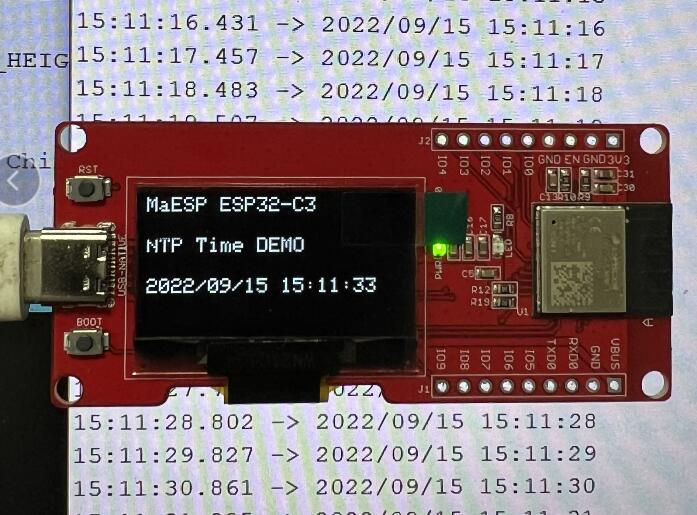
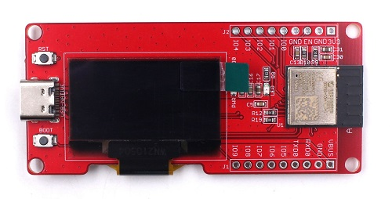
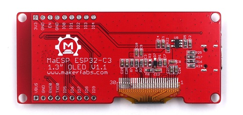
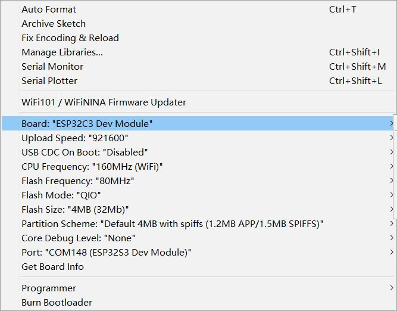

# MaESP ESP32 C3 OLED

```c++
/*
Version:		V1.1
Author:			Vincent
Create Date:	2022/9/23
Note:
	2022/10/26	V1.1: Add product link and wiki link
*/
```



[toc]

# Makerfabs

[Makerfabs home page](https://www.makerfabs.com/)

[Makerfabs Wiki](https://makerfabs.com/wiki/index.php?title=Main_Page)

# MaESP ESP32 C3 OLED
## Intruduce

Product Link ： [MaESP ESP32-C3 Board with 1.3" OLED](https://www.makerfabs.com/maesp-esp32-c3-board-with-1-3-oled.html)

Wiki Link : [MaESP ESP32-C3 OLED](https://wiki.makerfabs.com/MaESP_ESP32_C3_OLED.html)

MaESP ESP32 C3 OLED equips with ESP32-C3, which is a single-core Wi-Fi and Bluetooth 5 (LE) microcontroller SoC, built around a 32-bit **RISC-V** chip processor with a four-stage pipeline that operates at up to 160 MHz, with 4MB Flash, 400KB SRAM. 






## Feature

- Controller: ESP32-C3-MINI-1-N4, 4MB Flash, RISCV-32bit, 160MHz, 400KB SRAM, Bluetooth 5
- Wireless: WiFi & Bluetooth 5.0
- Power Supply: USB Type-C 5.0V(4.0V~5.25V)
- Button: Flash button and reset button
- Arduino support: Yes
- Operation temperature: -40℃ to +85℃


# Code

## Complier Option

- Install board : ESP32 .
- Install library : Adafruit_SSD1306, Adafruit_GFX libraries. 
- Use type-c use cable connect USBto PC.
- Upload codes, select "ESP32-C3 DEV Module"
- Some times need press boot button and reset, when COM port not appear.




## Firmware


## Example

### CDC_OLED

Different from the commonly used Arduino, the USB interface is directly connected to the ESP32C3, without CP2104 and other chips.

 Therefore, to enable the serial port to send logs normally, use the USBSerial object. This demo show how to use USBSerial and show logo on OLED.


### NTP_Time

Need chang wifi config .

```c++
#define SSID "Makerfabs"
#define PWD "20160704"
```

Will display NTP time to OLED.


### DHT11_ThingSpeak

Need change ThingSpeak upload url to yourself.

```c++
    String url = "http://api.thingspeak.com/update?api_key=KCAT79TTH52MG7EA&field1=";
    url = url + t + "&field2=" + h;
```

It sends the current temperature and humidity to ThingSpeak when it starts up, and periodically displays the latest temperature and humidity to the OLED.

 

